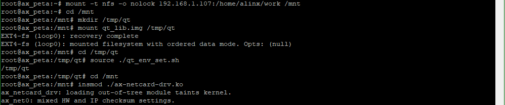
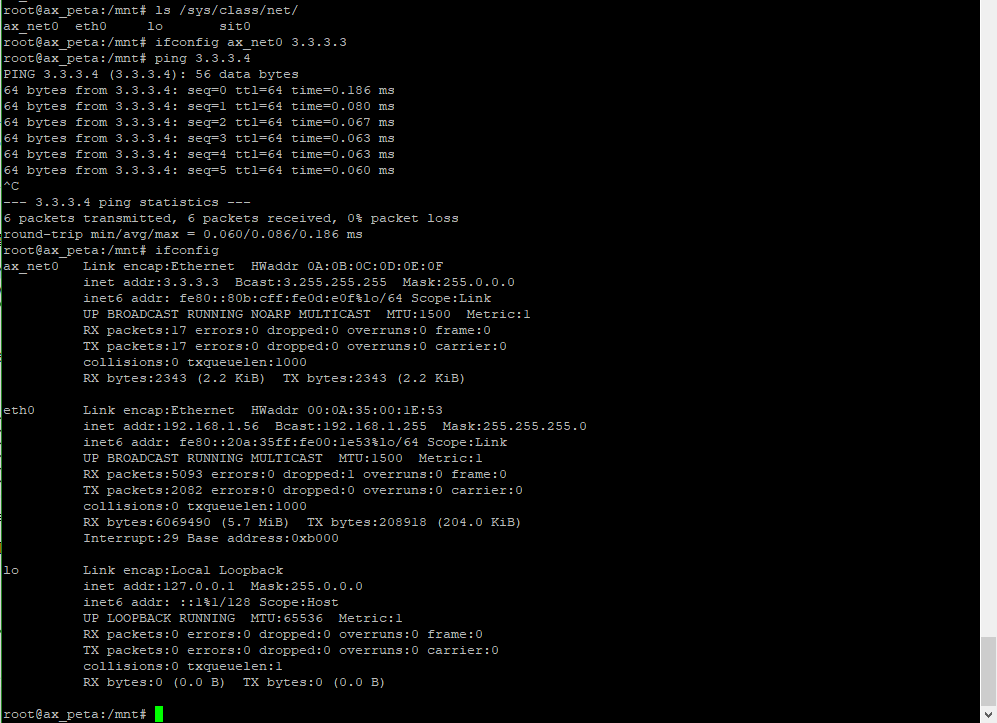

网卡驱动
===================

Linux网卡驱动
------------------

注意这里说的是网卡驱动不是网络驱动。网络驱动是相当繁杂的。我们知道OSI七层网络模型从上往下为：应用层、表示层、会话层、传输层、网络层、数据链路层、物理层，而Linux中使用TCP/IP四层模型为：应用层、传输层、网际层、网络接口层。

+------------+--------------+
| OSI        | Linux TCP/IP |
+============+==============+
| 应用层     |              |
+------------+              |
| 表示层     | 应用层       |
+------------+              |
| 会话层     |              |
+------------+--------------+
| 传输层     | 传输层       |
+------------+--------------+
| 网络层     | 网际层       |
+------------+--------------+
| 数据链路层 | 网络接口层   |
+------------+              |
| 物理层     |              |
+------------+--------------+

网卡驱动是被包含于网络驱动中的一环，属于网络接口层，包括数据链路层和物理层。也是网络驱动中唯一与硬件相关的部分，其他的都是纯软件的概念，对于底层驱动开发而言，只需要关心硬件相关的内容，因此这里我们来学习网卡驱动。

网卡驱动需要实现两个部分，一是和上层交互数据收发，二是结合具体硬件处理数据。网络接口层中又可以细分四层：网络协议接口层、网络设备接口层、设备驱动功能层、网络设备与媒介层。网络协议接口层负责对上层发送或接收数据，设备驱动层负责对硬件发送或接收数据，网络设备接口层则在中间起到数据承接的作用，网络设备层则负责实际的数据收发操作。

这里的关键就是网络设备接口层，Linux使用net_device结构体来描述一个网络设备信息，并对不同得硬件做了概括和统一。

从功能得角度看，网卡设备需要实现的功能有三，初始化、发送和接受，我们以net_device结构体为切入点，以三个需要实现的功能为引来看Linux网卡驱动程序的实现方法。

22.1.1 初始化
~~~~~~~~~~~~~

net_device结构体表示一个网卡，网卡的初始化，实际也就是定义一个net_device结构体变量，并初始化这个变量。先看一下net_device结构体的具体定义，在文件include/linux/netdevice.h中，如下(有省略和更改)：

.. code:: c

 struct net_device {
 char name[IFNAMSIZ]; //网卡设备名称
 struct hlist_node name_hlist;
 char *ifalias;

 unsigned long mem_end; //该设备的内存结束地址
 unsigned long mem_start; //该设备的内存起始地址
 unsigned long base_addr; //该设备的内存 I/O 基地址
 int irq; //该设备的中断号

 atomic_t carrier_changes;

 unsigned long state; //网络设备和网络适配器的状态信息

 ……

 struct net_device_stats stats; //用来保存统计信息的 net_device_stats 结构体

 ……

 const struct net_device_ops *netdev_ops;
 //网络设备操作函数
 ……

 unsigned int flags; //flags 指网络接口标志,常见取值如下
 //IFF_UP:设备被激活并可以开始发送数据包时设置该标志
 //IFF_AUTOMEDIA:设置设备可在多种媒介间切换
 //IFF_BROADCAST:允许广播
 //IFF_DEBUG:调试模式
 //IFF_LOOPBACK:回环
 //IFF_NOARP:无可执行 ARP,点对点接口就不需要运行ARP
 //IFF_POINTOPOINT:点到点链路
 ……

 unsigned int mtu; //最大数据包
 unsigned short type; //接口的硬件类型
 unsigned short hard_header_len;
 //硬件帧头长度,一般被赋为 ETH_HLEN 值为 14

 ……
 unsigned long last_rx; //接收数据包的时间戳,调用 netif_rx()后赋上jiffies 即可
 unsigned char *dev_addr; //MAC 地址

 ……
 };

除了一些基本信息名称、地址之外，最为关键的成员就是struct
net_device_ops类型的指针变量netdev_ops，他包含了网络设备的操作函数集我们需要实现的发包函数也包含在其中，看一下他的具体定义，也在这个文件中，如下(有省略)：

.. code:: c

 struct net_device_ops {
 ……
 int (*ndo_open)(struct net_device *dev);
 int (*ndo_stop)(struct net_device *dev);
 netdev_tx_t (*ndo_start_xmit)(struct sk_buff *skb,
 struct net_device *dev);
 ……
 };

ndo_open用于开启网络设备，ndo_stop用于关闭网络设备。

ndo_start_xmit函数就是关键的发包函数了。

再看一下net_device结构体中的struct net_device_stats
stats成员，net_device_stats结构体定义如下：

.. code:: c

 struct net_device_stats {
 unsigned long rx_packets;
 unsigned long tx_packets;
 unsigned long rx_bytes;
 unsigned long tx_bytes;
 unsigned long rx_errors;
 unsigned long tx_errors;
 unsigned long rx_dropped;
 unsigned long tx_dropped;
 unsigned long multicast;
 unsigned long collisions;
 unsigned long rx_length_errors;
 unsigned long rx_over_errors;
 unsigned long rx_crc_errors;
 unsigned long rx_frame_errors;
 unsigned long rx_fifo_errors;
 unsigned long rx_missed_errors;
 unsigned long tx_aborted_errors;
 unsigned long tx_carrier_errors;
 unsigned long tx_fifo_errors;
 unsigned long tx_heartbeat_errors;
 unsigned long tx_window_errors;
 unsigned long rx_compressed;
 unsigned long tx_compressed;
 };

实际就是网络状态的统计信息合集，我们会在收发处理函数中去操作这个stats来记录状态。

可见net_device结构体变量是网卡设备的关键，网卡设备的初始化也就是net_device结构体变量的初始化，步骤如下：

1) 定义一个net_device结构体变量

2) 使用函数alloc_netdev()分配一个net_device结构体变量

3) 初始化硬件寄存器

4) 设置net_device结构体变量成员变量

5) 使用register_netdev()注册net_device结构体变量

**alloc_netdev()**\ 是个宏定义，具体如下：

+-----------------------------------------------------------------------+
| alloc_netdev(sizeof_priv, name, name_assign_type, setup)              |
+-----------------------------------------------------------------------+

第一个参数sizeof_priv为私有变量的大小。

第二个参数name为设备名。

第三个参数name_assign_type为设备来源名称。

第四个参数setup为net_device的setup()函数指针，setup()函数接收的参数为struct
net_device指针，用于预置net_device成员的值。

**register_netdev()**\ 只有一个输入参数就是需要注册的net_device结构体变量指针。

发包
~~~~~~~~~~~

发包函数ndo_start_xmit需要我们自己构建，原型如下：

+-----------------------------------------------------------------------+
| netdev_tx_t (\*ndo_start_xmit)(struct sk_buff \*skb, struct net_device|
| \*dev);                                                               |
+-----------------------------------------------------------------------+

第一个输入参数struct
sk_buff是只socket(套接字)缓冲区，用于网络模型中各层之间的数据传递。struct
sk_buff定义在文件include/linux/skbuff.h中，是一个双向链表，如下(有省略)：

.. code:: c
   
 struct sk_buff {
 union {
 struct {
 /* These two members must be first. */
 struct sk_buff *next; //指向下一个 sk_buff 结构体
 struct sk_buff *prev; //指向前一个 sk_buff 结构体
 ……
 };
 ……
 };

 ……

 unsigned int len, //数据包的总长度,包括线性数据和非线性数据
 data_len; //非线性的数据长度
 __u16 mac_len, //mac 包头长度
 hdr_len;

 ……

 __u32 priority; //当前 sk_buff 结构体的优先级

 ……

 __be16 protocol; //存放上层的协议类型,可以通过 eth_type_trans()来获取
 __u16 transport_header; //传输层头部的偏移值
 __u16 network_header; //网络层头部的偏移值
 __u16 mac_header; //MAC 数据链路层头部的偏移值

 ……

 /* public: */

 /* These elements must be at the end, see alloc_skb() for details. */
 sk_buff_data_t tail; //指向缓冲区的数据包末尾
 sk_buff_data_t end; //指向缓冲区的末尾
 unsigned char *head, //指向缓冲区的协议头开始位置
 *data; //指向缓冲区的数据包开始位置
 ……
 };
 

sk_buff中个数据段排布空间如下：

数据段中又分为几段：

+-----------------+----------------+-----------------+----------------+
| MAC头           | IP头           | 数据类型        | 数据           |
+-----------------+----------------+-----------------+----------------+

MAC头用结构体ethhdr表示。

IP头用结构体iphdr表示。

数据类型为一个字节。

发包函数ndo_start_xmit中具体要做的是如下：

1) 调用函数netif_stop_queue()停止上层下传数据。

2) 通过硬件发送数据。

3) 调用函数dev_kfree_skb()释放sk_buff。

4) 发送成功进入中断时，更新统计信息，调用netif_wake_queue()函数，使上层继续下发数据。

5) 发送超时则在net_device_ops中的ndo_tx_timeout函数中调用netif_wake_queue()函数，使上层继续下发数据。

**dev_kfree_skb()**\ 函数原型如下：

+-----------------------------------------------------------------------+
| #define dev_kfree_skb(a) consume_skb(a)                               |
|                                                                       |
| void consume_skb(struct sk_buff \*skb)                                |
+-----------------------------------------------------------------------+

**netif_wake_queue()**\ 函数原型如下：

+-----------------------------------------------------------------------+
| static inline void netif_wake_queue(struct net_device \*dev)          |
+-----------------------------------------------------------------------+

**netif_stop_queue()**\ 函数原型如下：

+-----------------------------------------------------------------------+
| static inline void netif_stop_queue(struct net_device \*dev)          |
+-----------------------------------------------------------------------+

收包
~~~~~~~~~~~

收包一般放在中断中处理。处理过程为：

1) 使用alloc_skb()函数构造一个sk_buff。

2) 使用skb_reserve(sk_buff,2)把sk_buff里的数据包先后位移2字节以腾出sk_buff里的头部空间。

3) 读取网络设备硬件上接收到的数据，把数据复制到sk_buff的成员data指针。

4) 使用eth_type_trans()函数来获取上层协议，将返回值赋给sk_buff的成员protocol。

5) 更新统计信息，最后使用netif_rx()将sk_buff上传到上层协议。

实验
---------

驱动程序
~~~~~~~~~~~~~~~

使用 petalinux新建名为”ax-netcard-drv”驱动程序，并执行 petalinux-config
-c rootfs 命令选上新增的驱动程序。

在ax-netcard-drv.c文件中输入下面的代码：

.. code:: c

 #include <linux/module.h>
 #include <linux/kernel.h>
 #include <linux/types.h>
 #include <linux/fcntl.h>
 #include <linux/ioport.h>
 #include <linux/in.h>
 #include <linux/skbuff.h>
 #include <linux/string.h>
 #include <linux/init.h>
 #include <linux/bitops.h>
 #include <linux/ip.h>
 #include <linux/netdevice.h>
 #include <linux/etherdevice.h>
 #include <asm/io.h>
 #include <asm/irq.h>
 
 /* 定义一个net_device结构体变量 */
 static struct net_device *ax_net_dev;
 static const unsigned char mac_addr[6] = {0x0A, 0x0B, 0x0C, 0x0D, 0x0E, 0x0F};
 /* 模拟接收, 构造一个虚拟的sk_buff上报, 并更新统计信息 */
 static void ax_net_rx(struct sk_buff *skb, struct net_device *dev)
 {
 	unsigned char *type;
 	struct iphdr *ih;
 	__be32 *saddr, *daddr, tmp;
 	unsigned char	tmp_dev_addr[ETH_ALEN];
 	struct ethhdr *ethhdr;
 	
 	struct sk_buff *rx_skb;
 
     /* 交换接受和发送方的mac地址 */
 	ethhdr = (struct ethhdr *)skb->data;
 	memcpy(tmp_dev_addr, ethhdr->h_dest, ETH_ALEN);
 	memcpy(ethhdr->h_dest, ethhdr->h_source, ETH_ALEN);
 	memcpy(ethhdr->h_source, tmp_dev_addr, ETH_ALEN);
   
     /* 交换接受和发送方的ip地址 */
 	ih = (struct iphdr *)(skb->data + sizeof(struct ethhdr));
 	saddr = &ih->saddr;
 	daddr = &ih->daddr;
 
 	tmp = *saddr;
 	*saddr = *daddr;
 	*daddr = tmp;
     
 	type = skb->data + sizeof(struct ethhdr) + sizeof(struct iphdr);
 	/* 修改类型, 0表示reply */
     *type = 0;
 	
 	ih->check = 0;
 	ih->check = ip_fast_csum((unsigned char *)ih,ih->ihl);
 	
     /* 构造sk_buff */
 	rx_skb = dev_alloc_skb(skb->len + 2);
 	skb_reserve(rx_skb, 2);
 	memcpy(skb_put(rx_skb, skb->len), skb->data, skb->len);
 
 	rx_skb->dev = dev;
 	rx_skb->protocol = eth_type_trans(rx_skb, dev);
 	rx_skb->ip_summed = CHECKSUM_UNNECESSARY;
 	dev->stats.rx_packets++;
 	dev->stats.rx_bytes += skb->len;
 
     /* 提交sk_buff */
 	netif_rx(rx_skb);
 }
 
 static netdev_tx_t ax_net_tx(struct sk_buff *skb, struct net_device *dev)
 {
 	static int cnt = 0;
     
     /* 停止上层数据下传队列 */
 	netif_stop_queue(dev);
     /* 模拟接收, 以达到一个完成的发送接收过程 */
 	ax_net_rx(skb, dev);
     /* 释放skb */
 	dev_kfree_skb (skb);
     /* 发送完成, 恢复上层数据下传队列 */
 	netif_wake_queue(dev);
     /* 更新统计信息 */
 	dev->stats.tx_packets++;
 	dev->stats.tx_bytes += skb->len;
 	
 	return NETDEV_TX_OK;
 }
 
 /* 网卡设备操作函数集 */
 static const struct net_device_ops ax_netdev_ops = 
 {
 	.ndo_start_xmit = ax_net_tx,
 };
 
 /* 驱动入口函数 */
 static int __init ax_net_init(void)
 {
     /* 分配net_device结构体 */
 	ax_net_dev = alloc_netdev(0, "ax_net%d", NET_NAME_UNKNOWN, ether_setup);
     /* 设置操作函数集 */
 	ax_net_dev->netdev_ops = &ax_netdev_ops;
 
     /* 设置MAC地址 */
     ax_net_dev->dev_addr = mac_addr;
     /* 设置ping功能 */
 	ax_net_dev->flags     |= IFF_NOARP;
 	ax_net_dev->features  |= NETIF_F_CSUM_MASK;	
     /* 注册网卡驱动 */
 	register_netdev(ax_net_dev);
 	
 	return 0;
 }
 
 /* 驱动出口函数 */
 static void __exit ax_net_exit(void)
 {
 	unregister_netdev(ax_net_dev);
 	free_netdev(ax_net_dev);
 }
 
 module_init(ax_net_init);
 module_exit(ax_net_exit);
 
 /* 驱动描述信息 */  
 MODULE_AUTHOR("Alinx"); 
 MODULE_ALIAS("net card test");  
 MODULE_DESCRIPTION("NET CARD driver");  
 MODULE_VERSION("v1.0");  
 MODULE_LICENSE("GPL"); 

94行的驱动入口函数中，先使用alloc_netdev()来分配一个net_device结构体，设置net_device结构体变量的成员，设置完成后使用register_netdev()向内核注册net_device结构体。设置net_device结构体变量成员主要是操作函数和105行和106行设置ping功能。

68行的发包函数中，先调用netif_stop_queue(dev)函数停止上层发送数据包，之后如果是真实的网卡，应该要调用硬件接口来发送数据因为这里是模拟网卡，所以直接调用模拟接受的函数表示发送完成。接受函数ax_net_rx()之后再看。发送完成后释放skb_buff并调用netif_wake_queue()函数恢复上层发送数据包。最后更新统计信息。

31行开始的模拟接受函数，本是应该放在接受中断中处理的。在接收函数中，修改sk_buff中的数据，使它变成一个接受sk_buff，计提方法就是对调erhhdr和iphdr结构体中发送、接收mac地址。使用ip_fast_csum函数重新获取iphdr校验。之后设置flag，0x08表示发送ping包，接受需要修改为0。重新构造sk_buff，重新赋值。使用eth_type_trans函数获取上层协议。最后调用netif_rx提交sk_buff。

运行测试
~~~~~~~~~~~~~~~

测试方法步骤如下：

+-----------------------------------------------------------------------+
| mount -t nfs -o nolock 192.168.1.107:/home/alinx/work /mnt            |
|                                                                       |
| cd /mnt                                                               |
|                                                                       |
| mkdir /tmp/qt                                                         |
|                                                                       |
| mount qt_lib.img /tmp/qt                                              |
|                                                                       |
| cd /tmp/qt                                                            |
|                                                                       |
| source ./qt_env_set.sh                                                |
|                                                                       |
| cd /mnt                                                               |
|                                                                       |
| insmod ./ax-netcard-drv.ko                                            |
+-----------------------------------------------------------------------+

IP 和路径根据实际情况调整。

加载驱动后，使用ls /sys/class/net/命令查看网卡驱动有没有存在。

再使用命令ifconfig ax_net0 3.3.3.3设置ip，之后就可以ping测试了。

之后使用ifconfig命令查看网卡信息，核对mac地址信息和收发包数的统计信息。

